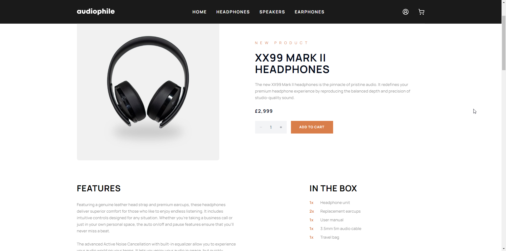

# Audiophile - Full-stack e-commerce website

This project is a full-stack e-commerce website built with Node.js and React, with a Postgres database. It is a website for a fictional company called Audiophile. The website has user accounts, a server-side cart, pulls product data from a PostgreSQL database and has Stripe integration for payment. It is fully responsive and should work well on all screen sizes.

The design for the website, along with the sample product data is from a challenge on [Frontend Mentor](https://www.frontendmentor.io/challenges/audiophile-ecommerce-website-C8cuSd_wx).

You can access the live app [here](https://audiophile.beneatock.com/).

The backend and database are hosted on fly.io, and the frontend is hosted on Netlify. Learning was at the fore of a lot of my decision making, so I really tried to follow best practices as much as I could.

I implemented a simple CI/CD pipeline for the backend, which triggers on every push to the server folder in the main branch. The pipeline builds the backend in a test environment with Docker, runs the tests and then builds and deploys to fly.io if the tests pass. The frontend deployment is handled by Netlify.

## Features

- **User accounts**: Users can create an account, log in and log out. A user must be logged in to add items to their cart, as the cart is server-sided. Session management is cookie-based and uses express-session and passportjs. A user can also see their order history.
- **Cart**: The cart is server-sided and is stored in a PostgreSQL database. A user can add items to their cart, remove items from their cart and change the quantity of items in their cart.
- **Checkout**: The checkout process offers multiple payment options including Stripe. A user can enter their shipping details and pay for their order. The order is then stored in the database and the user can see their order history.
- **Responsive Design**: The website is fully responsive and should work well on all screen sizes.

## Tech

- **General**: TypeScript, Docker
- **Frontend**: React, Vite, React Router, React Query, TailwindCSS, Shadcn-UI
- **Backend**: Node.js, Express, Passport.js, node-postgres
- **Database**: PostgreSQL
- **Other**: Stripe
