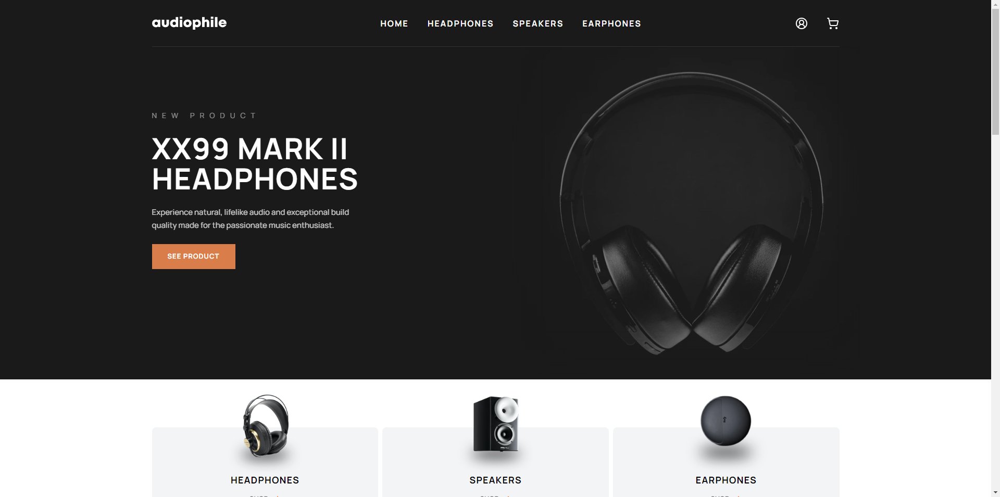

# Audiophile - Full-stack e-commerce website

This project is a full-stack e-commerce website built with Node.js and React, with a Postgres database. It is a fictional website for a fictional company called Audiophile. The website has user accounts, Stripe integration, a server-side cart and pulls product data from a PostgreSQL database. It is fully responsive and should work well on all screen sizes.

The design for the website, along with the sample product data is from a challenge on [Frontend Mentor](https://www.frontendmentor.io/challenges/audiophile-ecommerce-website-C8cuSd_wx).

You can access the live app [here](https://audiophile.beneatock.com/).

## Purpose

This project was built as an exercise to learn more about full-stack development. I felt that a full-stack e-commerce site was a valuable practice project as it required me to learn about many different aspects of full-stack development, including authentication, session management, database management, payment processing and more.

The backend and database are hosted on fly.io, and the frontend is hosted on Netlify. I tried to implement as many best practices as possible, including using TypeScript, using a linter and formatter, using a CI/CD pipeline and more.

## Features

- **User accounts**: Users can create an account, log in and log out. A user must be logged in to add items to their cart, as the cart is server-sided. Session management is cookie-based and uses express-session and passportjs. A user can also see their order history.
- **Cart**: The cart is server-sided and is stored in a PostgreSQL database. A user can add items to their cart, remove items from their cart and change the quantity of items in their cart.
- **Checkout**: The checkout process offers multiple payment options including Stripe. A user can enter their shipping details and pay for their order. The order is then stored in the database and the user can see their order history.
- **Responsive Design**: The website is fully responsive and should work well on all screen sizes.

## Tech

- **Frontend**: React, Vite, TypeScript, React Router, React Query, TailwindCSS, Shadcn-UI
- **Backend**: Node.js, Express, TypeScript, Passport.js
- **Database**: PostgreSQL, node-postgres
- **Other**: Stripe
